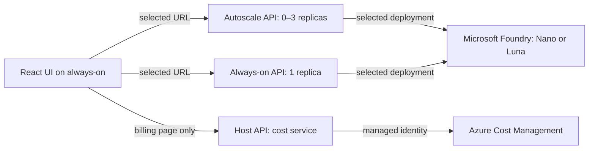

# Architecture and measurement boundaries

## Request flow

Serve the UI from the always-on URL for experiments. Browsing a frontend hosted
on the autoscale app would itself wake that app. Chat requests go directly to
the selected backend; the UI does not poll the other app, send warm-up requests,
or automatically retry inference. Cross-origin preflight requests can also reach
the selected backend; Azure/browser behavior affects observed startup latency.

## Responsibilities

`main.py` owns resource lifecycles and constructs service implementations. Routes
use `ChatService` and `CostService` protocols through FastAPI dependencies. The
Foundry adapter owns inference and safe error translation. The billing adapter
owns Azure authentication, pagination, caching and decimal aggregation. Pydantic
validates inputs; the frontend validates returned contracts with Zod.

React feature components render UI; the chat hook manages request state and
cancellation. Pure functions handle bounded context and measurement summaries.
There is no global framework or repository layer for data that is not persisted.

## Chat and credentials

Only the two configured model IDs and known backend IDs are accepted. Foundry
deployment names, endpoints and keys stay server-side. Backend identity is checked
before inference, so a wrong URL cannot silently invalidate a comparison. The
server rejects extra input fields, system-role messages, oversized requests and
conversations over 21 messages or 32,000 characters. The newest prompt is limited
to 8,000 characters. The client trims oldest complete turns to fit these limits.

Responses request `store=False`. Conversation content stays in browser memory
and is sent to Foundry for inference; provider retention policies still apply.
Messages render as text, never raw HTML. Server logs include request IDs, model,
backend, timing and token metadata, not prompts, responses or credentials.

The deployment retains the existing client-IP ingress allowlist. CORS permits
only explicitly configured origins. This is an experiment for trusted clients,
not a public multi-user service: add user authentication and per-user quotas
before broadening access. Browser cancellation stops waiting but does not
promise cancellation of Azure inference or its charges.

## Billing accuracy

The backend queries `ActualCost`, grouped daily by `ResourceId`, using a fixed
subscription and resource allowlist. It validates pagination URLs before passing
Azure tokens, rejects mixed currencies, and sums decimal amounts before converting
them for JSON display. Empty, disconnected and failed states stay distinct.
Missing daily rows within an otherwise valid report mean zero **reported** cost;
they are not proof of zero activity. Negative credits remain negative.

Only the configured resource IDs are included. Shared registry/environment
charges are kept separate; costs billed to unlisted resources, subscription-level
charges or resources without matching IDs are not included in the tracked total.
Foundry account totals are not attributed to individual models or backends.
Accurate per-model attribution would require deployment/meter-level billing
records and a verified mapping; token ratios are not used to invent a split.

Session token/latency measurements cover only requests in the current tab.
They do not represent total cloud traffic, replica count, cold-start duration,
or invoice-level cost per message. Use equal traffic patterns and comparable
measurement windows for fair infrastructure comparisons. Keep load testing
separate and deliberate; the chat UI does not generate background load.

## Sources

- [Microsoft Cost Management Query API](https://learn.microsoft.com/en-us/rest/api/cost-management/query/usage?view=rest-cost-management-2025-03-01)
- [Azure cost data latency](https://learn.microsoft.com/en-us/azure/cost-management-billing/costs/understand-cost-mgt-data)
- [Azure Container Apps scaling](https://learn.microsoft.com/en-us/azure/container-apps/scale-app)
- [GPT-6 Luna API model documentation](https://developers.openai.com/api/docs/models/gpt-6-luna)

The deployment names and Foundry availability are supplied by the project owner;
OpenAI API documentation alone does not establish deployment availability in Azure.
